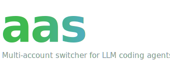
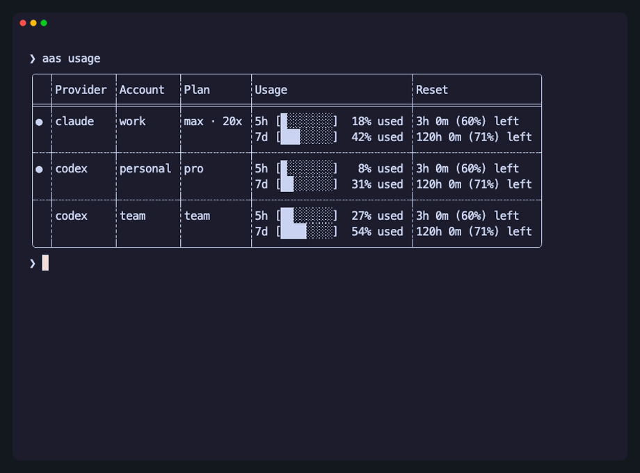
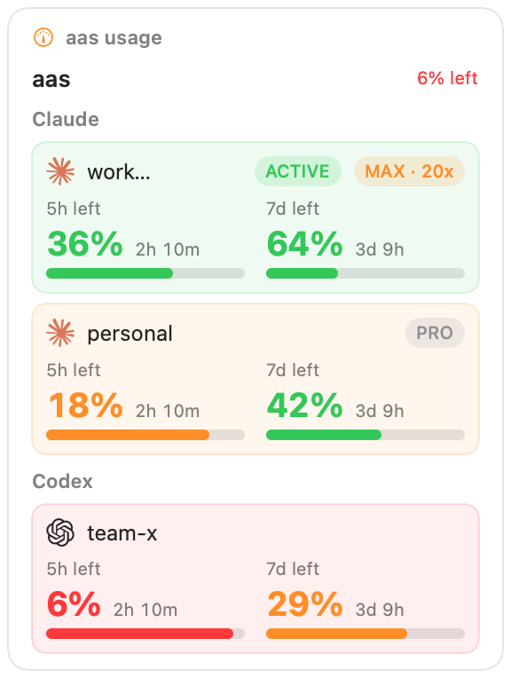

<div align="center"></div>

# aas — Agent Account Switcher

A single-binary, dependency-free **multi-account switcher for LLM coding agents**
(Claude Code, Codex, Grok/xAI, Z.AI, Cursor, Pi). Rust rewrite of
[`asx`](https://github.com/enif-lee/asx).

- Store each account's credential in its own `0600` file / OS keychain entry and switch instantly.
- Run one-off, profile-scoped agent sessions without touching your default login.
- Cross-provider execution: run one agent's UI against another provider's backend (ASX Proxy).
- Usage at a glance (`aas usage`) — accounts resolve in parallel through a shared success cache;
  use `--fresh` for an explicit live request.
- **Reads existing `asx` state** — drop-in adoption, usually zero re-login.

<div align="center">
  
  <br />
  <sub>Rendered from the reproducible <a href="docs/assets/cli-demo.tape">VHS tape</a>.</sub>
</div>

## Quickstart for Agents

Paste this into your coding agent (Claude Code, Codex, …) to install and set up `aas`:

<div></div>

```
Install the aas CLI (Agent Account Switcher) from https://github.com/Open330/aas

1. macOS/Linux — run:  curl -fsSL https://raw.githubusercontent.com/open330/aas/main/install.sh | sh
   (Windows PowerShell:  irm https://raw.githubusercontent.com/open330/aas/main/install.ps1 | iex)
2. Verify it works:     aas --version
3. Show my accounts and live usage:  aas list  &&  aas usage

aas reads my existing asx state, so my current logins should already appear.
```

<div></div>

## Install

macOS / Linux (single static binary — no Node, no runtime):

```bash
curl -fsSL https://raw.githubusercontent.com/open330/aas/main/install.sh | sh
```

Windows PowerShell:

```powershell
irm https://raw.githubusercontent.com/open330/aas/main/install.ps1 | iex
```

The installers fetch the latest published GitHub Release, verify its SHA-256 checksum, and run
the downloaded binary before replacing an existing installation.

From source:

```bash
git clone https://github.com/Open330/aas.git
cd aas
cargo install --path crates/aas-cli --locked   # -> ~/.cargo/bin/aas
```

## Quick start

```bash
# Add accounts (each stored as its own isolated profile)
aas login claude work
aas login codex personal              # opens a browser
aas login codex server --headless     # CLI-only box: device-code flow (no browser)

# Pi authenticates in its TUI; snapshot its complete auth.json afterwards
pi                                      # run /login
aas load pi personal

# See what you have, and live quota for every account (parallel fetch)
aas list
aas usage

# Make a stored account the active one (writes the provider's native login)
aas switch codex personal

# Run the native agent under a profile, without changing your default login
aas exec work -- --version

# Cross-provider: run Claude's UI on the codex backend (via the local proxy)
aas exec personal.codex claude
aas exec personal.codex pi -- -p "run Pi on the Codex backend"

# Use a profile in the *current shell* without switching your default
eval "$(aas export personal.codex)"       # POSIX (bash/zsh)
aas export zai work                        # prints: export ZAI_API_KEY="…"
aas export codex work --shell fish | source          # fish
aas export codex work --shell powershell | iex       # PowerShell

# Adopt / inspect existing asx state (usually a no-op — aas reads the same files)
aas import

# Move ALL accounts + credentials to another host
aas export --all | ssh other-host aas import -    # over ssh — nothing touches disk
aas export --all -o creds.json                     # …or a file (0600); scp it, then: aas import creds.json

# Password-encrypted vault (age/scrypt); import auto-detects it
aas export --all --vault -o aas-vault.age
scp aas-vault.age jiun-mbp:
scp aas-vault.age jiun-mini:
ssh -t jiun-mbp 'aas import ~/aas-vault.age'
ssh -t jiun-mini 'aas import ~/aas-vault.age'
```

`switch` vs `exec` vs `export`:

- **`switch <name>`** writes the stored credential to the provider's native location
  (`~/.codex/auth.json`, Claude keychain, …) so running `codex`/`claude` directly uses it.
- **`exec <name>`** runs the agent under a profile-scoped home without touching your default.
- **`export <name>`** prints the env (`CODEX_HOME=…`, `ZAI_API_KEY=…`, …) to activate a
  profile in the current shell only.

`load` is different: it snapshots the **currently logged-in** native credential into a profile
(`aas load codex`), rather than activating a stored one.

## Commands

| Command | Description |
|---|---|
| `list [provider\|account]` (alias `ls`) `-u`,`-d`, `--sort name\|added\|stored` | List all accounts or filter by provider/account. The default is provider-registry order then account name; `stored` preserves the `accounts.json` array order. `-u` shows live usage; `-d` dumps stored credentials. |
| `usage [provider\|account]` (alias `u`) `--json`, `--fresh`, `--sort name\|added\|stored` | Usage for all accounts or one provider/account (shorthand for `list -u`), using a shared 10-minute success cache and deterministic order. `--fresh` bypasses the success cache but still honors rate-limit backoff. `--json` is the integration contract used by aas-bar and BarShelf. |
| `status [provider]` | Show the active account per provider. |
| `login [provider] [name]` `--long-lived`, `--device-auth`/`--headless`, *share flags* | Login and store a new **isolated** profile. `--long-lived` uses Claude's `setup-token`; `--device-auth` uses a browserless device-code flow. |
| `load [provider] [name]` | Snapshot the **currently logged-in** credential as a **system** profile (auto-scans providers if none given). |
| `switch <provider> <name>` or `switch <account>` (alias `s`) | Make a stored account the active credential. The one-argument form resolves a globally unique stored account name. |
| `exec <name> [target] [args…]` (alias `e`) | Run the native CLI under a profile. If `target` ≠ the profile's provider, requests route through the local **ASX Proxy** (cross-provider). `-b` full-access bypass; cross-run share flags `-s/-i/--share/--isolate/--keep-context`; `--` passes the rest to the agent. |
| `export [name]` or `export <provider> <name>` `--all`, `--vault`, `-o <file>`, `--shell posix\|fish\|powershell` | Print shell env to use a profile in the current shell (`eval "$(aas export <name>)"`), or `--all` for a portable bundle of **every account + credential**. `--vault` encrypts it with an age/scrypt passphrase. |
| `sharing <name>` *share flags* | Show or change which state (sessions/skills/agents/hooks/settings) an isolated profile shares from the provider's home. |
| `rename <from> <to>` | Rename an account (moves its profile home + markers). |
| `remove [provider] <name>` (alias `rm`) | Remove a stored account. |
| `refresh <provider> <name>` or `refresh <account>` `--no-login` | Rotate a credential via its refresh token (falls back to login unless `--no-login`). |
| `proxy <name> <frontend>` | Start a standalone ASX Proxy for `<name>`'s backend and print env to point a `<frontend>` agent at it. |
| `import [file]` | No arg: adopt/inspect existing `asx` state. With a file (or `-` for stdin): restore a bundle from `export --all` on another host. |

Vault passphrases are read from the terminal without echo. For non-interactive automation, set
`AAS_VAULT_PASSPHRASE` only for the lifetime of the command. Imports merge by provider/account:
existing matching accounts are updated, while a name already owned by another provider is skipped.
The bundle contains AAS-managed account metadata and provider credentials, not browser cookies,
agent conversation history, or machine-specific active-account markers.

**Share flags** (for `login` / `sharing`, and per-run on cross-provider `exec`): `--shared`
(default), `--isolated`, `--share <a,b,…>`, `--isolate <a,b,…>` over the categories
`sessions, skills, agents, hooks, settings`.

**Providers:** `claude`, `codex`, `grok` (alias `xai`), `zai`, `cursor`, `pi`.

Colors respect `NO_COLOR` and only apply on a TTY.

## BarShelf widget

Prefer the menubar? This repo ships an `aas usage` widget for
[BarShelf](https://github.com/Open330/barshelf), a scriptable menubar
widget platform:

<div align="center">
  
</div>

```bash
mbk install https://github.com/Open330/aas
```

See [`widgets/barshelf-aas-usage/`](widgets/barshelf-aas-usage/) for details
(deep link, requirements, permissions).

## Status

The port covers the `asx` P1–P5 surface plus the current post-v0.3.0 proxy/provider updates:
Pi, GPT-5.6 Sol/Terra/Luna, live Grok/Z.AI model discovery, Claude tier aliases,
Anthropic `count_tokens`, strict tool-argument normalization, and Grok OIDC refresh. It includes
storage/keychain/import, provider adapters,
parallel `usage`, account management, same- and cross-provider `exec`, the translating proxy,
and staged static-binary releases. Rust and Swift tests, strict lint/docs checks, installer
parsing, and portable app-bundle verification run in CI. See
[`docs/DESIGN.md`](docs/DESIGN.md) and [`docs/PARITY_SPEC.md`](docs/PARITY_SPEC.md).

## Develop

```bash
cargo build
cargo fmt --all -- --check
cargo clippy --workspace --all-targets --all-features -- -D warnings
cargo test --workspace --all-targets --all-features

# Regenerate the README CLI demo (requires VHS)
vhs docs/assets/cli-demo.tape
```

See [CONTRIBUTING.md](CONTRIBUTING.md) for the complete development workflow,
[SECURITY.md](SECURITY.md) for private vulnerability reporting,
[SUPPORT.md](SUPPORT.md) for support channels, [CODE_OF_CONDUCT.md](CODE_OF_CONDUCT.md) for
community expectations, and [CHANGELOG.md](CHANGELOG.md) for release history.

## License

[MIT](LICENSE). Bundled provider logos are trademarks of their respective owners and are used
only for identification.
