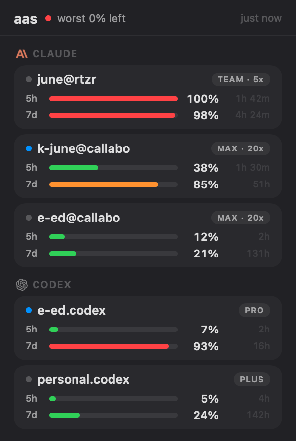
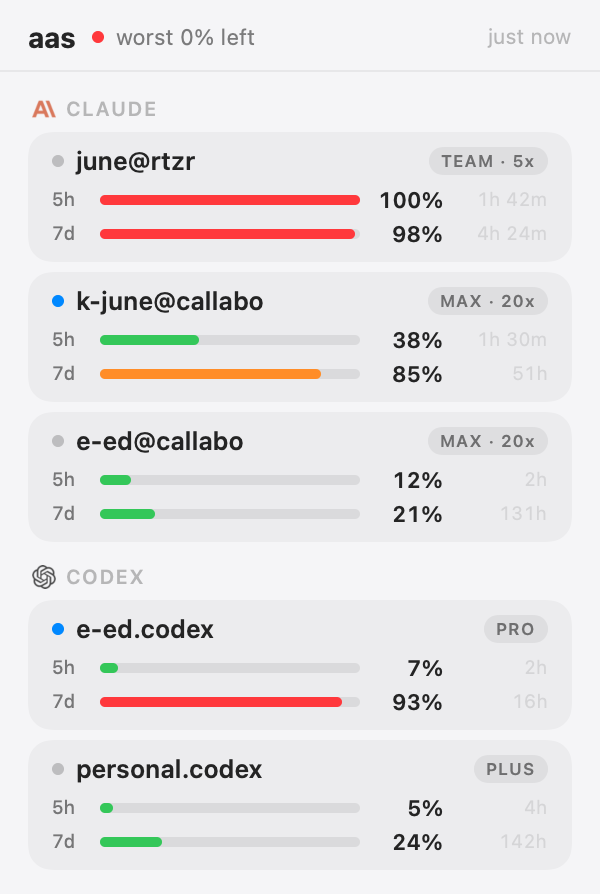

<div align="center">

# aas‑bar

### Every LLM account's remaining quota — one glance away in your menubar.

<p>
  
  &nbsp;&nbsp;
  
</p>


</div>

---

A native SwiftUI menubar companion for [**`aas`**](../../README.md) (the agent‑account
switcher). A colored **ring gauge** in the menubar summarizes your worst remaining quota;
click it for a frosted popover with a card per account — real brand marks, health‑coded
usage bars, plans, and reset times. It answers *"am I about to run out?"* without a terminal.

The engine stays the `aas` CLI — the app just runs `aas usage --json` and renders it.

## ✨ Features

- **Ring‑gauge menubar icon** — fills with the worst account's usage, green → amber → red.
- **Native popover** — vibrancy background, SF Pro, follows system light/dark.
- **Per‑account cards** — brand logo per provider, active‑account dot, plan chip
  (`MAX · 20x`), two health‑colored meters (5h / 7d) with `%` and reset time.
- **Sorted by urgency** — the account you'll hit first floats to the top.
- **No polling by design** — shows a cached snapshot; hits the network only when you press
  **Refresh** (the usage API is rate‑limited — the CLI also honors `Retry-After`).
- **Launch at Login** and **Quit** from the `⋯` menu.

## 📋 Requirements

- **macOS 14** (Sonoma) or later
- The **`aas`** CLI, built with `aas usage --json` support and reachable at
  `$AAS_BIN`, `~/.local/bin/aas`, `~/bin/aas`, `~/.cargo/bin/aas`, or on your `PATH`:
  ```bash
  # from the repo root
  cargo install --path crates/aas-cli
  ```

## 🚀 Install

```bash
cd apps/aas-bar
./build-app.sh --install     # builds AasBar.app and copies it to /Applications
open /Applications/AasBar.app
```

`build-app.sh` (no `--install`) just produces `./AasBar.app` next to the sources — run it
with `open ./AasBar.app`.

> **Why a bundle?** A SwiftUI `MenuBarExtra` only shows its menubar item when launched from a
> proper `.app` (with `LSUIElement`), not as a bare `swift run` binary.

### Launch at login

Open the popover → `⋯` → **Launch at Login**. (Or System Settings → General → Login Items →
add `AasBar.app`.)

## ⚙️ Configuration

| Env var | Effect |
|---|---|
| `AAS_BIN` | Absolute path to the `aas` binary (overrides the search). |

The app looks for `aas` at `$AAS_BIN` → `~/.local/bin/aas` → `~/bin/aas` →
`~/.cargo/bin/aas` → `/opt/homebrew/bin` → `/usr/local/bin` → `/usr/bin` → `PATH`.
GUI apps inherit a minimal `PATH`, hence the search.

## 🧩 How it works

```
MenuBarExtra (SwiftUI)
  ├─ RingGauge label ......... worst-usage arc, health-colored
  └─ PopoverView ............. header · provider sections · account cards · footer
        ▲
        │  Process
  aas usage --json ........... {"accounts":[{provider,name,active,plan,planLabel,
                                              error,notes,meters:[{label,usedPct,resetMs}]}]}
```

Results are cached to `~/Library/Application Support/aas-bar/usage-cache.json` and shown on
launch; **Refresh** re‑runs the CLI and updates the cache.

## 🛠 Development

```bash
swift build -c release        # build the executable
swift run                     # runs, but the menubar item needs the .app bundle
```

**Design snapshots** — render the popover to a PNG without launching the UI (handy for
iterating on layout):

```bash
AAS_BAR_SNAPSHOT=/tmp/pop.png AAS_BAR_SCHEME=dark  .build/release/AasBar
AAS_BAR_SNAPSHOT=/tmp/pop.png AAS_BAR_SCHEME=light .build/release/AasBar
```

**Layout**

```
apps/aas-bar/
├─ Package.swift
├─ build-app.sh                 # assembles + signs AasBar.app (bundles logos)
├─ Info.plist                   # LSUIElement (menubar agent)
├─ Sources/AasBar/
│  ├─ AasBarApp.swift           # @main App, MenuBarExtra, ring label, snapshot mode
│  ├─ PopoverView.swift         # popover, cards, linear meters, provider marks
│  ├─ Model.swift               # UsageModel (runs aas), Codable, health/color helpers
│  └─ Resources/                # bundled brand logos (template PNGs)
└─ docs/                        # screenshots
```

## License

MIT — same as the parent project. Provider logos are trademarks of their respective owners,
bundled only as small monochrome marks for identification.
